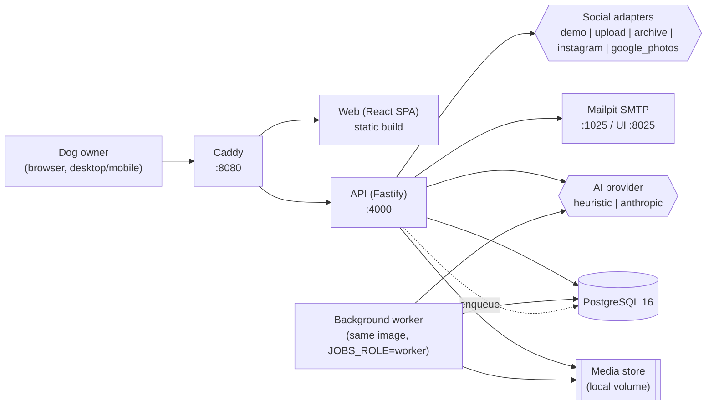
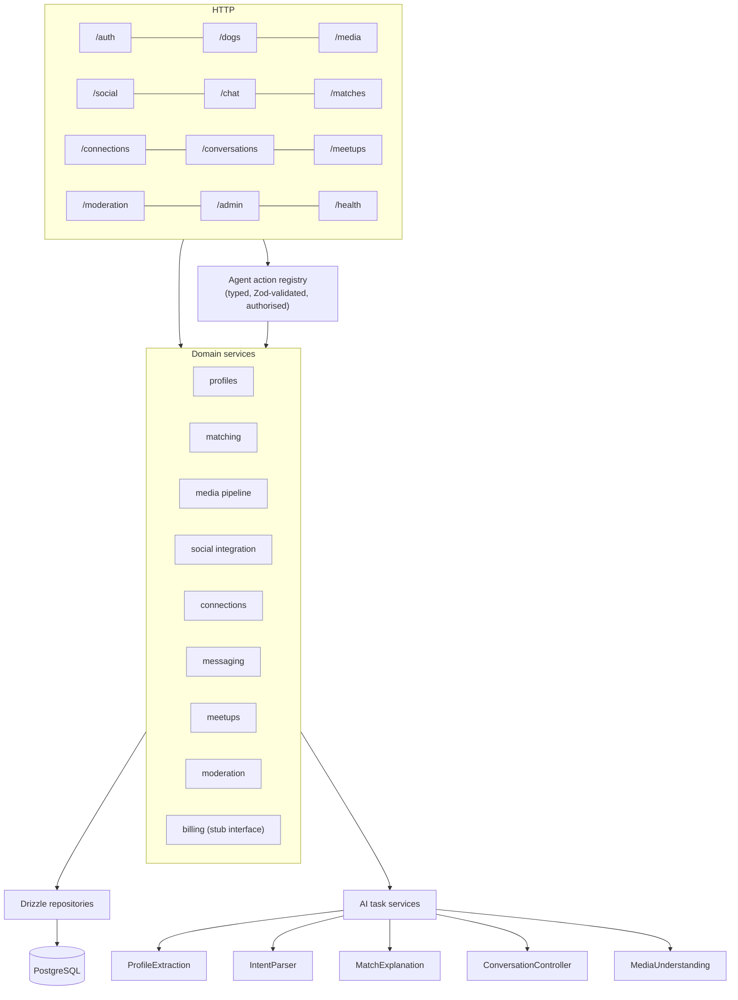
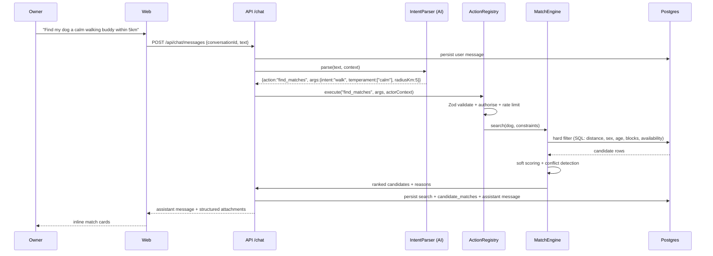
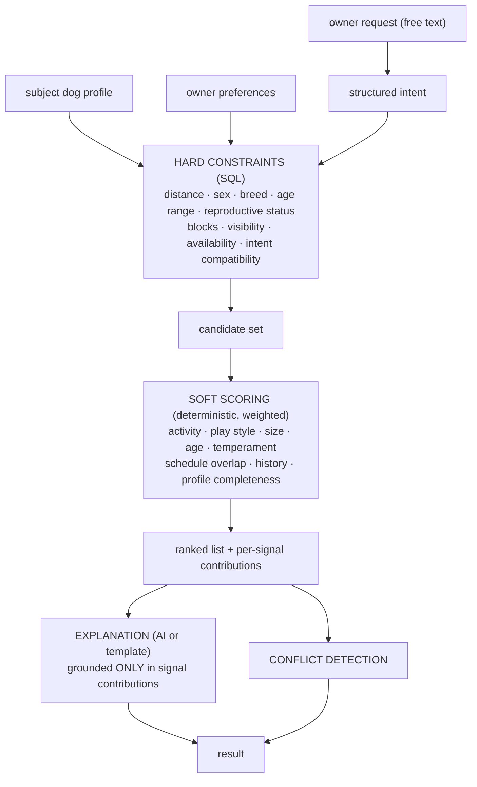
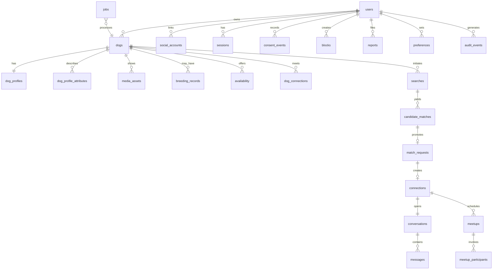
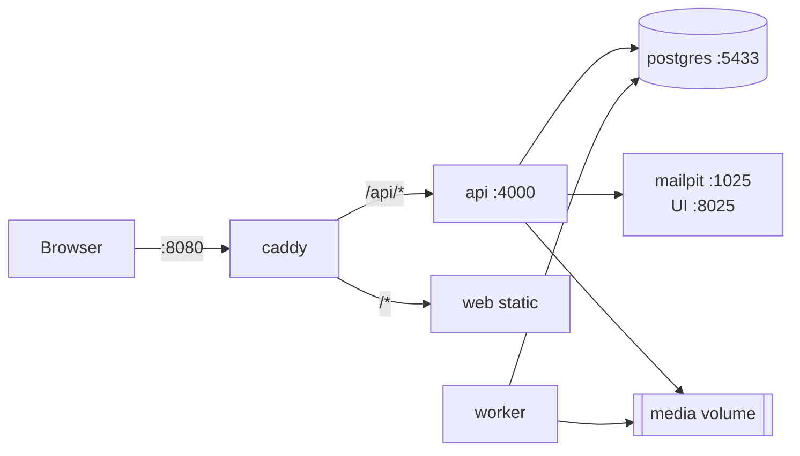

# Doggystyle — Architecture

## 1. Stack

| Layer | Choice | Why |
| --- | --- | --- |
| Runtime | Node.js 22 LTS (dev host: Node 24) + TypeScript (strict, ESM) | One language across API/web/tests; huge talent pool |
| API | Fastify 5 + Zod | Fast, schema-first, first-class TS, tiny surface vs. Nest |
| DB | PostgreSQL 16 (+ `pgcrypto`, `cube`, `earthdistance`) | Real relational modelling; geo distance without PostGIS weight |
| ORM / migrations | Drizzle ORM + drizzle-kit (SQL migrations) | SQL-first, no native engine binaries, trivial to add extensions |
| Frontend | React 19 + Vite 7 + TypeScript + Tailwind 4 | Boring, fast HMR, best-supported |
| Client data | TanStack Query + React Router 7 | Cache/invalidation without a bespoke store |
| Jobs | Postgres-backed job table + in-process worker (`SELECT … FOR UPDATE SKIP LOCKED`) | No Redis until there is a concrete reason |
| Media storage | Local filesystem behind a `MediaStore` interface | Swap for S3 later without touching callers |
| Auth | Opaque session tokens (hashed at rest) in httpOnly cookies + magic link + password (argon2id) | Revocable, no JWT footguns |
| AI | Provider interface with `heuristic` (offline, deterministic) and `anthropic` implementations | Whole product runs with **zero** API keys |
| Mail | Mailpit in dev (SMTP catcher w/ web UI) | See magic links locally; swap SMTP host for prod |
| Edge | Caddy 2 reverse proxy | Single origin for web + API ⇒ same-site cookies, no CORS |
| Tests | Vitest (unit/integration) + Supertest-style inject + Playwright (E2E) | One runner for TS, real browser for the critical path |
| Orchestration | Docker Compose | `docker compose up` is the whole system |

Rejected: Kubernetes (no problem it solves here), Redis (no problem yet), MongoDB (relational domain),
Prisma (native engines + awkward extension support), a dedicated vector DB (pgvector column suffices).

Full rationale per decision: `docs/adr/`.

## 2. System context



## 3. Backend module map



**Rule:** HTTP routes and the conversational agent both go through the same domain services. The LLM
never issues SQL and never receives raw DB handles — it may only emit an action name + arguments,
which are validated with Zod and executed under the caller's own authorisation context.

## 4. Conversational request flow



## 5. Media pipeline

```mermaid
flowchart LR
  IN["source import<br/>(upload / demo / archive / OAuth)"] --> N["metadata normalisation<br/>EXIF strip, dimensions, hash"]
  N --> D["duplicate detection<br/>(sha256 + dHash)"]
  D --> C["dog-content classification<br/>score 0..1"]
  C --> ID["dog identity clustering<br/>(visual signature k-means-lite)"]
  ID --> Q["quality scoring<br/>(sharpness, exposure, framing, size)"]
  Q --> SEL["profile-photo selection"]
  SEL --> ATTR["attribute extraction<br/>(breed/size/activity candidates + captions)"]
  ATTR --> CONF["owner confirmation<br/>(conversational)"]
```



Each stage is a job type in the `jobs` table so the pipeline is resumable and observable. Images are
re-encoded with `sharp` (strips EXIF/GPS, normalises format, generates 3 renditions).

## 6. Matching engine



Determinism first: filtering and scoring are pure functions over structured data and are unit-tested.
AI only *phrases* the explanation from already-computed signals — it cannot change the ranking.

## 7. Data model (core)



Full DDL: `apps/api/drizzle/*.sql`. Table-by-table notes: `docs/DATA_MODEL.md`.

### Attribute provenance

`dog_profile_attributes` is the heart of the "never invent facts" principle:

```
(dog_id, key) → value_json, source, confidence, user_confirmed, observed_at, updated_at
source ∈ vision_model | text_model | social_import | user | verified_document | system_default
```

`sensitive` keys (health, genetics, pedigree, reproductive) reject any non-`user`/`verified_document`
source at the service layer *and* via a DB `CHECK` constraint.

## 8. Social integration layer

```ts
interface SocialProvider {
  readonly id: ProviderId;
  readonly capabilities: ProviderCapabilities; // media? captions? profile? refresh?
  authorize(ctx): Promise<AuthorizeResult>;     // returns redirect URL or inline instructions
  handleCallback(ctx): Promise<LinkedAccount>;
  refreshToken(acct): Promise<LinkedAccount>;
  getProfile(acct): Promise<ExternalProfile>;
  getMedia(acct, cursor?): Promise<Page<ExternalMediaItem>>;
  revoke(acct): Promise<void>;
}
```

Shipped adapters:

| id | status | notes |
| --- | --- | --- |
| `demo` | ✅ working offline | Simulates an authorised account with a seeded photo set |
| `upload` | ✅ working | Direct multi-file upload |
| `archive` | ✅ working | Instagram/Facebook/Google Takeout ZIP/JSON export importer |
| `instagram` | ⚙️ implemented, needs credentials | Instagram Graph API (Business/Creator). Requires Meta app + App Review |
| `google_photos` | ⚙️ implemented, needs credentials | Picker API scope; user picks items |

Feasibility analysis and exactly what a human must do: `docs/INTEGRATIONS.md`.

## 9. AI architecture

Five independent task services, each with its own schema and prompt, behind one provider interface:

| Service | Input | Output | Offline behaviour |
| --- | --- | --- | --- |
| `ProfileExtraction` | media features + captions + text | attribute candidates w/ confidence | keyword/breed lexicon + media stats |
| `IntentParser` | utterance + context | typed intent + action + args | grammar/regex + synonym lexicon |
| `MatchExplanation` | scored signal contributions | reason bullets + conflicts | templated from signals |
| `ConversationController` | turn + state | next action + reply plan | rule-based dialogue policy |
| `MediaUnderstanding` | image buffer | dog-ness, visual signature, quality | colour/edge/entropy heuristics via `sharp` |

`AI_PROVIDER=heuristic` (default) makes every path work with no network and no keys.
`AI_PROVIDER=anthropic` + `ANTHROPIC_API_KEY` upgrades quality; all outputs are still Zod-validated
and fall back to the heuristic implementation on error/timeout.

**Prompt-injection posture:** untrusted content (captions, other users' messages, imported text) is
wrapped in `<untrusted>` fences with an explicit instruction that it is data. The model's output is
never executed directly — only mapped onto the whitelisted action registry with validated args, and
each action re-checks authorisation server-side.

## 10. Runtime topology (local)



One command: `docker compose up` (or `./start.sh` / `.\start.ps1`, which pre-flight the environment,
generate `.env`, build, migrate and seed).

## 11. Designed-for extensions

| Future need | Seam that already exists |
| --- | --- |
| S3/GCS media | `MediaStore` interface (`local` impl today) |
| WhatsApp/SMS | `MessageTransport` interface + `message_deliveries` table |
| Push/email notifications | `Notifier` interface + `notifications` table |
| Payments/subscriptions | `BillingService` interface + `plan`/`entitlements` on users |
| Geo scale | distance filter isolated in one SQL builder; swap to PostGIS/H3 index |
| Recommendation learning | `dog_connections` + `meetup_outcomes` + `candidate_matches` feedback rows |
| Mobile app | API is cookie- or bearer-token capable; no server-rendered coupling |
| Group meetups | `meetup_participants` join table is already n-ary |
| Vector semantic search | `pgvector` column on `dog_profiles.embedding` (opt-in flag) |
