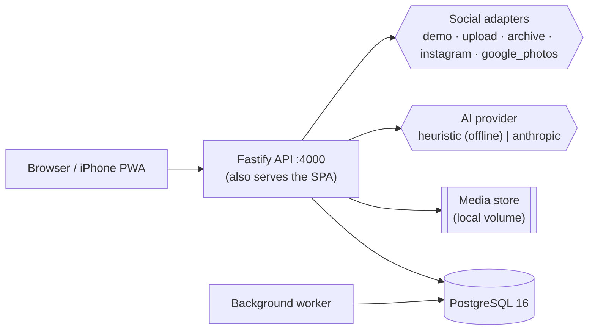

<div align="center">

# 🐾 Doggystyle

**Tell us what you want for your dog. We do the rest.**

A conversational service for dog owners — it builds your dog's profile from photos you
already have, finds genuinely compatible dogs nearby, explains *why*, and helps you
arrange the meetup. All inside one chat box.

</div>

---

## See it work

https://github.com/boggioMichael/doggystyle/raw/main/docs/media/doggystyle-demo.mp4


*A real recording of the running system — no mockups. Landing prompt → sign-up → connect a
photo source → the media pipeline imports and classifies → auto-generated profile →
"He's actually four, not three." → ranked matches with reasons → confirmation-gated
introduction → mutual acceptance → messaging → meetup.*

## Quick start

```powershell
.\start.ps1
```

That is the whole thing. On first run it creates `.env` with fresh secrets, downloads a
self-contained PostgreSQL into `.tools/` (no installer, no admin rights), migrates, seeds
a demo neighbourhood, builds the web app, and serves everything at **http://localhost:4000**.

| | |
| --- | --- |
| **Demo owner** | `owner1@demo.doggystyle.local` / `Demo123!` |
| **Admin** | `admin@doggystyle.local` / `DemoAdmin!2026` |
| **Stop** | `.\stop.ps1` |
| **Fresh database** | `.\start.ps1 -Fresh` |
| **Hot reload** | `.\start.ps1 -Dev` (web on :5173, API on :4000) |

You do not need an API key. The AI runs locally and offline by default.

### On your iPhone

The app installs to the home screen as a PWA.

1. Run `.\scripts\allow-lan.ps1` once and accept the UAC prompt (opens port 4000 on
   private networks only).
2. On your phone, on the same Wi-Fi, open the `http://<your-ip>:4000` address that
   `start.ps1` prints.
3. **Share → Add to Home Screen.**

---

## Why it exists

Every dog-social product fails the same three ways:

| Problem | What happens | What Doggystyle does |
| --- | --- | --- |
| Profile creation is a chore | Sparse, stale profiles; nobody finishes onboarding | The system **proposes** a full profile from your photos; you confirm or correct it |
| Matching is appearance-first swiping | Mismatched energy, bad meetups, churn | Deterministic matching on activity, play style, size, temperament and schedule — with the reasoning shown |
| Coordination happens off-platform | No feedback loop, no network effects | Introductions, messaging and meetup scheduling all live in the product |

## The customer experience

The whole product is one prompt box. Everything else appears *inside the conversation*.

```
┌──────────────────────────────────────────────┐
│                 🐾 Doggystyle                │
│       What would you like for your dog?      │
│   ┌────────────────────────────────────────┐ │
│   │ Find my dog an energetic playmate      │ │
│   │ nearby this weekend...                 │ │
│   └────────────────────────────────────────┘ │
│                                     Send →   │
│   Find a walking buddy · Find dogs nearby    │
│   Arrange a playdate · Find a mating match   │
└──────────────────────────────────────────────┘
```

1. **Sign up** — email + password, or a passwordless link.
2. **Connect a photo source** — demo, direct upload, or an authorised platform export.
   No scraping, no passwords, no browser automation.
3. **The system finds your dog** — photos are classified, grouped per-dog, quality-scored,
   and the best shot becomes the profile picture.
4. **A complete profile appears** — breed, age, size, energy, play style, temperament.
   Every field shows where it came from and how confident the system is.
5. **You correct it by talking** — *"He's actually four, not three."* · *"Remove that
   second picture."* · *"We moved to Haifa."* · *"Only find dogs within 15 km."*
6. **You state a goal** and get ranked matches inline:

   ```
   Milo — 91% match
   2-year-old Border Collie · ~4 km away

   Why:
   • Similar activity level
   • Both enjoy long outdoor walks
   • Owners are usually free Friday mornings

   Heads up:
   • Milo is slightly larger than your preferred range
   ```

7. **Introductions are mutual.** Nobody is ever committed to meeting a stranger
   automatically.
8. **Then you message and arrange a meetup** — the suggested spot is a public place near
   the midpoint between you; nobody's address is shared.

### Two things it deliberately does *not* do

- **It never invents facts about your dog.** Breed and energy can be inferred from photos
  and captions. Health, genetics, pedigree, vaccination and reproductive status **cannot** —
  those stay blank until you enter them. Enforced by a database constraint, not convention.
- **It never presents a mating match as breeding approval.** Mating is a separate, explicit
  mode that reports *what information exists*, with a standing disclaimer.

---

## Architecture



| Layer | Choice |
| --- | --- |
| API | Node 22+, TypeScript (strict, ESM), Fastify 5, Zod |
| Database | PostgreSQL 16, Drizzle ORM, hand-written SQL migrations |
| Web | React 19, Vite 7, Tailwind 4, TanStack Query, React Router 7 |
| Jobs | Postgres-backed queue (`FOR UPDATE SKIP LOCKED`) — no Redis |
| AI | Offline heuristic provider by default; Anthropic optional |
| Tests | End-to-end smoke suite + Playwright |

Full detail in [`ARCHITECTURE.md`](ARCHITECTURE.md). Every significant decision has an
ADR in [`docs/adr/`](docs/adr/).

### Three decisions worth knowing

1. **The LLM can only call a typed action registry** ([ADR 0004](docs/adr/0004-typed-agent-action-layer.md)).
   The model's sole output is an action name plus arguments. Arguments are re-validated,
   ids resolve only from the actor's own context, and sensitive actions park in a
   confirmation table until a human clicks. Prompt injection cannot reach the database.
2. **Matching is deterministic; the AI only phrases explanations**
   ([ADR 0005](docs/adr/0005-deterministic-matching-ai-explanations.md)). Hard constraints
   in SQL, weighted scoring as a pure function, then the model turns computed signal
   contributions into sentences. It cannot reorder or invent candidates.
3. **Every attribute carries provenance** ([ADR 0006](docs/adr/0006-attribute-provenance.md)).
   `value / source / confidence / user_confirmed / timestamp`, with sensitive keys
   rejected at the database level if they carry a model source.

## Privacy

Your exact location is never sent to another user — not in an API response, not in a
distance, not in photo metadata. Distances are bucketed, stored coordinates are snapped to
a ~1 km grid, uploaded images are re-encoded to strip EXIF/GPS, and meetup locations are
public places revealed only after both owners agree. See [`PRIVACY.md`](PRIVACY.md) and
[`docs/THREAT_MODEL.md`](docs/THREAT_MODEL.md).

## Testing

```bash
node scripts/smoke.mjs           # 32 end-to-end assertions against a running server
cd apps/web && npx playwright test    # browser E2E
cd apps/web && npx playwright test --project=demo-video   # re-record the demo
```

The smoke suite walks the full journey and asserts the safety properties: CSRF rejection,
IDOR returning 404 (never 403), no email or exact coordinates in any response body,
bucketed distances, confirmation-gated introductions, and admin routes closed to normal
users.

## Environment variables

Everything has a working default; `.env` is generated on first run.

| Variable | Default | Purpose |
| --- | --- | --- |
| `BRAND_NAME` | `Doggystyle` | Product name — change here, changes everywhere |
| `DATABASE_URL` | local Postgres | Connection string |
| `AI_PROVIDER` | `heuristic` | `heuristic` (offline, free) or `anthropic` |
| `ANTHROPIC_API_KEY` | — | Only needed for `AI_PROVIDER=anthropic` |
| `DEMO_MODE` | `true` | Seeded data + "simulate other owner" controls |
| `SERVE_WEB` | `false` | Serve the built SPA from the API (single origin) |
| `MAIL_TRANSPORT` | `store` | `store` keeps mail in the DB (Admin → Mailbox) or `smtp` |
| `INSTAGRAM_APP_ID` / `GOOGLE_CLIENT_ID` | — | Enable real providers ([setup steps](docs/INTEGRATIONS.md)) |

Full list in [`.env.example`](.env.example).

## Common problems

| Symptom | Fix |
| --- | --- |
| `initdb` fails with an encoding error | The repo path must be ASCII-only (a non-Latin username breaks Postgres init) |
| Missing `vcruntime140.dll` | `scripts/pg-local.ps1` copies it automatically; otherwise install the [VC++ redistributable](https://aka.ms/vs/17/release/vc_redist.x64.exe) |
| Phone cannot reach the server | Run `.\scripts\allow-lan.ps1` and accept the UAC prompt |
| Port 4000 already in use | `.\stop.ps1` |
| Sign-in link never arrives | It is captured locally — Admin → Mailbox |
| Migration checksum mismatch | An applied migration was edited; add a new one instead |

More in [`docs/RUNBOOK.md`](docs/RUNBOOK.md).

## Docker

`docker-compose.yml` runs the same stack (Postgres, API+worker, Mailpit) if you prefer:

```bash
docker compose up
```

The native path above is the primary one on Windows — Docker Desktop is not required.

## Documentation

| | |
| --- | --- |
| [`ARCHITECTURE.md`](ARCHITECTURE.md) | Stack, module map, data model, diagrams |
| [`docs/PRODUCT_SPEC.md`](docs/PRODUCT_SPEC.md) | Requirements and user journeys |
| [`docs/THREAT_MODEL.md`](docs/THREAT_MODEL.md) | STRIDE analysis, safety decisions |
| [`docs/INTEGRATIONS.md`](docs/INTEGRATIONS.md) | What each provider can actually do, and the exact steps to enable it |
| [`docs/adr/`](docs/adr/) | Architecture decision records |
| [`PRIVACY.md`](PRIVACY.md) · [`SECURITY.md`](SECURITY.md) | Data handling and hardening |
| [`docs/business/`](docs/business/) | Business plan and a [plan-vs-build reconciliation](docs/business/PLAN_VS_BUILD.md) |

## Status

The end-to-end journey works and is verified on every run of the smoke suite. Before any
public pilot this still needs: a production environment (TLS, backups, monitoring), a
per-module unit test suite, real content moderation, stronger age assurance, and — per the
business plan — a **name change with trademark clearance**. See
[`docs/business/PLAN_VS_BUILD.md`](docs/business/PLAN_VS_BUILD.md) for the honest gap list.

## Licence

**Business Source License 1.1** — source-available, converts to Apache 2.0 on 2030-08-16.
Personal, internal, research and educational use is free; running it as a commercial or
hosted service needs a commercial licence. See [`LICENSE`](LICENSE) and
[`LICENSING.md`](LICENSING.md).
