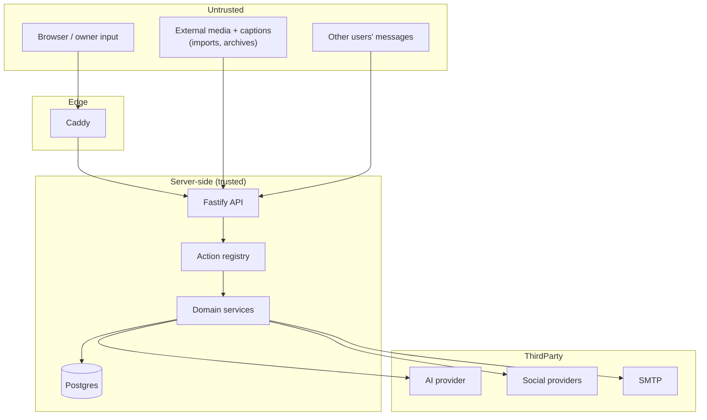

# Doggystyle — Threat Model

Method: STRIDE over the data-flow diagram in `ARCHITECTURE.md` §2, plus product-specific risks
(physical meetups, prompt injection, breeding data).

## 1. Assets

| # | Asset | Impact if compromised |
| --- | --- | --- |
| A1 | Owner identity + credentials | Account takeover, real-world stalking |
| A2 | **Exact location** of home/dog | Physical safety — highest severity |
| A3 | Session cookies / CSRF posture | Account takeover |
| A4 | OAuth tokens for social providers | Access to owner's external account |
| A5 | Private messages | Harassment, doxxing |
| A6 | Media assets (photos, EXIF GPS) | Location leakage via metadata |
| A7 | Breeding/health records | Commercial harm, fraud |
| A8 | Admin console | Full compromise |
| A9 | AI action layer | Unauthorised state change via injected text |

## 2. Trust boundaries

Everything crossing into *Trusted* is validated with Zod at the boundary; everything crossing out to
*ThirdParty* is minimised (no exact coordinates, no emails, no full names are sent to the AI
provider — see §6).

## 3. STRIDE findings and mitigations

### Spoofing

| Threat | Mitigation | Where |
| --- | --- | --- |
| Credential stuffing | argon2id, per-email + per-IP rate limits, generic error messages | `modules/auth` |
| Magic-link replay / guessing | 32-byte CSPRNG token, hashed at rest (SHA-256), single-use, 15-min TTL, bound to email | `modules/auth/magicLink.ts` |
| Session fixation | New token minted on every login; old session revoked on password change | `modules/auth/session.ts` |
| Session theft via XSS | httpOnly + SameSite=Lax + Secure(when TLS); token never in JS-readable storage | `plugins/session.ts` |
| Admin impersonation | `role` on user + `requireAdmin` guard + separate audit stream | `modules/admin` |

### Tampering

| Threat | Mitigation |
| --- | --- |
| CSRF (state-changing requests) | Double-submit token: `ds_csrf` non-httpOnly cookie must equal `x-csrf-token` header on all non-GET; SameSite=Lax as defence in depth |
| Mass assignment | Zod schemas with `.strict()`; no `req.body` spread into ORM |
| SQL injection | Drizzle parameterised queries only; zero string-concatenated SQL (enforced by a lint test) |
| Client-side score forgery | Matching runs server-side; results persisted to `candidate_matches` and re-read by id |
| Sensitive attribute forgery | DB `CHECK` constraint: sensitive keys require `source in ('user','verified_document')` |

### Repudiation

- `audit_events` records actor, action, target, IP hash, request id, before/after summary.
- Moderation actions, consent changes, deletions and admin views are all audited.

### Information disclosure — **the highest-risk category for this product**

| Threat | Mitigation |
| --- | --- |
| Exact home location leak | `exact_lat/exact_lng` are `NULL` unless the owner opts in; **no** serializer ever emits them. Public DTOs expose only `city`, `country`, `geohash5` and a bucketed distance. A test asserts no response body contains those keys. |
| Location triangulation via distance | Distances are quantised (`<1km`, then 0.5 km buckets ≤10 km, 1 km buckets ≤50 km, then "50 km+"), and the *stored* coarse point is snapped to a ~1.1 km grid before distance maths |
| EXIF GPS in uploaded photos | All images re-encoded through `sharp` with metadata stripped; original bytes are never served |
| IDOR on dogs/media/messages/meetups | Every read path takes `actorUserId`; ownership/participation asserted in the service, not the route. Dedicated permission test suite (`tests/permissions.spec.ts`) |
| Enumeration of users/dogs by id | Public ids are UUIDv4; list endpoints scoped to the actor; 404 (not 403) for non-visible resources |
| Media served to non-participants | `/api/media/:id/file` checks visibility rules; no direct static exposure of the media volume |
| Blocked user still visible | Blocks filter matching, search, messaging and introductions in SQL, bidirectionally |
| Email disclosure | Email never appears in any peer-visible DTO |
| Data exfiltration via AI provider | Redaction layer strips emails, exact coords, tokens, phone numbers before any model call |

### Denial of service

| Threat | Mitigation |
| --- | --- |
| Auth brute force / spam signup | Sliding-window limiter keyed on ip+route+identity |
| Upload flooding | Max 12 MB/file, 30 files/request, per-user daily quota, MIME sniffing by magic bytes |
| Expensive search abuse | Search rate limit + hard `LIMIT` + candidate cap before scoring |
| Job queue starvation | Attempt cap + exponential backoff + dead-letter state, visible in admin |
| Decompression bombs (archive import) | Entry count, per-entry and total uncompressed size caps; path traversal rejected |

### Elevation of privilege

| Threat | Mitigation |
| --- | --- |
| **Prompt injection → action execution** | (1) LLM output is *only* an action name + args; (2) args re-validated with Zod; (3) each action re-authorises server-side against the *session* actor, never a model-supplied id; (4) actions are categorised `read`/`write`/`sensitive`, and `sensitive` actions (deletion, blocking, sending an introduction, disclosing location) require an explicit human confirmation step in the UI; (5) untrusted text is fenced and labelled as data |
| Model-supplied ids | Any id in model output is resolved against the *actor's own* candidate set from the current conversation; foreign ids are rejected |
| Admin route exposure | `requireAdmin` + audit + separate rate limit + not reachable via the agent action layer at all |

## 4. Product-specific risks

### R1 — Physical safety at meetups
- Mutual consent required before any contact detail or precise location is shared.
- Meetup locations are suggested **public places**, never an address from a profile.
- Report + block available from every peer-facing surface; reports create a moderation queue item.
- Safety guidance is shown on first meetup acceptance (`docs/SAFETY.md` content rendered in-app).

### R2 — Age policy (documented decision)
**Decision: account holders must be 18+.** This is a person-to-person offline meetup product;
matching minors with adult strangers is an unacceptable risk and creates COPPA/GDPR-K obligations we
do not intend to satisfy. Enforcement in MVP is self-attestation at signup plus recorded terms
acceptance (`consent_events`), with a documented upgrade path to third-party age assurance.
Under-18 attestation blocks account creation.

### R3 — Breeding harm
The product must not imply veterinary or breeding approval. Mating matches surface **data
completeness**, never an AI "compatibility %". Health/genetic/pedigree data cannot be model-inferred
(enforced by constraint). A persistent disclaimer is attached to every mating result.

### R4 — Harassment / unwanted contact
Messaging only opens after mutual acceptance; either side can revoke a connection, which closes the
conversation. Blocks are bidirectional and irreversible without support action.

### R5 — Platform-policy violation
No scraping, no credential collection, no automation of logged-in third-party UIs. Providers that
cannot be legitimately accessed yet are shipped disabled with documented human steps
(`docs/INTEGRATIONS.md`).

## 5. Secrets

- No secrets in git. `.env` is gitignored; `.env.example` holds placeholders only.
- `start.ps1`/`start.sh` generate strong random values for `SESSION_SECRET`, `TOKEN_PEPPER`,
  `POSTGRES_PASSWORD` on first run.
- OAuth tokens are encrypted at rest with AES-256-GCM using a key derived from `TOKEN_PEPPER`
  (`lib/crypto.ts`); the DB never stores plaintext provider tokens.
- A `npm run check:secrets` script scans the tree for high-entropy strings and known key prefixes.

## 6. Data minimisation sent to third parties

Before any AI provider call, `ai/redact.ts` removes: email addresses, phone numbers, exact
coordinates, street addresses, session/OAuth tokens, and full owner names. A unit test asserts the
redactor on a corpus of representative payloads.

## 7. Residual risks accepted for the local MVP

| Risk | Why accepted | Upgrade path |
| --- | --- | --- |
| Self-attested age | No free, privacy-respecting age assurance at MVP scale | Integrate an age-assurance vendor pre-launch |
| Heuristic content moderation | No local model available offline | `ModerationProvider` interface — swap in a hosted classifier |
| No TLS on localhost | Local-only deployment | Caddy auto-HTTPS is one config line when a domain exists |
| No email deliverability | Mailpit catches mail locally | Set `SMTP_*` to a transactional provider |
| Identity of dog owners unverified | Out of MVP scope | `verifications` table + document/vet partner flow |
